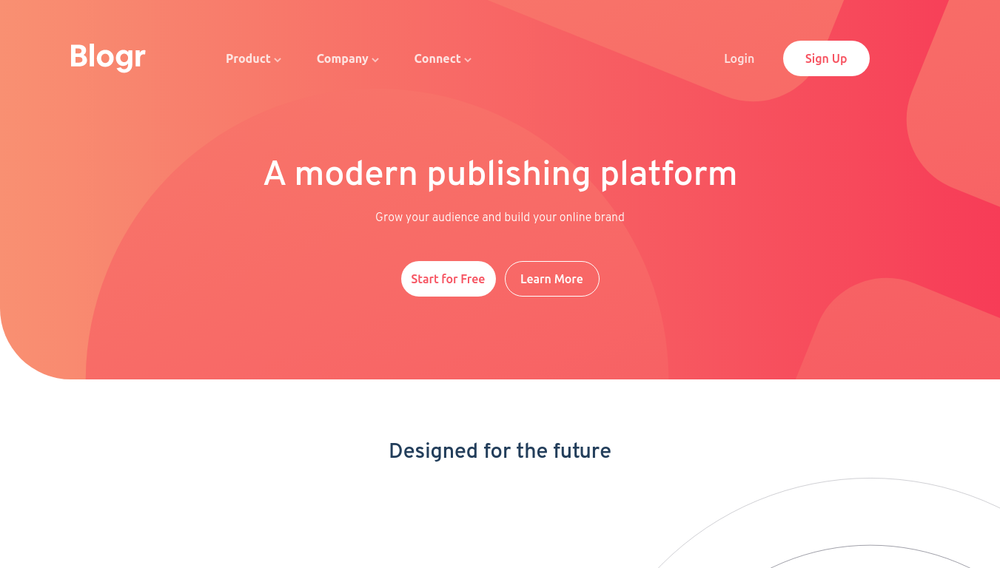

# Frontend Mentor - Blogr landing page solution

This is a solution to the [Blogr landing page challenge on Frontend Mentor](https://www.frontendmentor.io/challenges/blogr-landing-page-EX2RLAApP). Frontend Mentor challenges help you improve your coding skills by building realistic projects. 

## Table of contents

- [Overview](#overview)
  - [The challenge](#the-challenge)
  - [Screenshot](#screenshot)
  - [Links](#links)
- [My process](#my-process)
  - [Built with](#built-with)
  - [What I learned](#what-i-learned)
- [Author](#author)

## Overview

### The challenge

Users should be able to:

- View the optimal layout for the site depending on their device's screen size
- See hover states for all interactive elements on the page

### Screenshot



### Links

- Solution URL: [https://www.frontendmentor.io/solutions/blogr-responsive-landing-page-d4p5CxqVD](https://www.frontendmentor.io/solutions/blogr-responsive-landing-page-d4p5CxqVD)
- Live Site URL: [https://emidiomatheus.github.io/blogr-landing-page](https://github.com/emidiomatheus/blogr-landing-page)

## My process

### Built with

- Semantic HTML5 markup
- CSS custom properties
- Flexbox
- CSS Grid
- Mobile-first workflow

### What I learned

```css
footer {
  display: grid;
  justify-items: center
}
```
```js
element.nextElementSibling
```

## Author

- Frontend Mentor - [@emidiomatheus](https://www.frontendmentor.io/profile/emidiomatheus)

